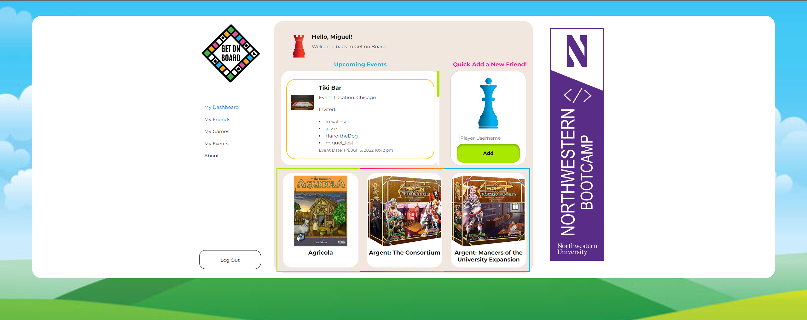
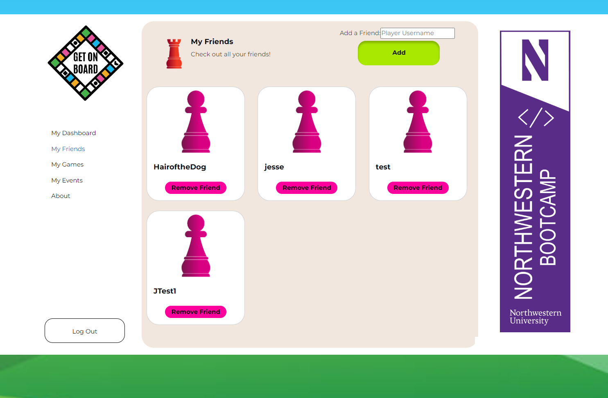
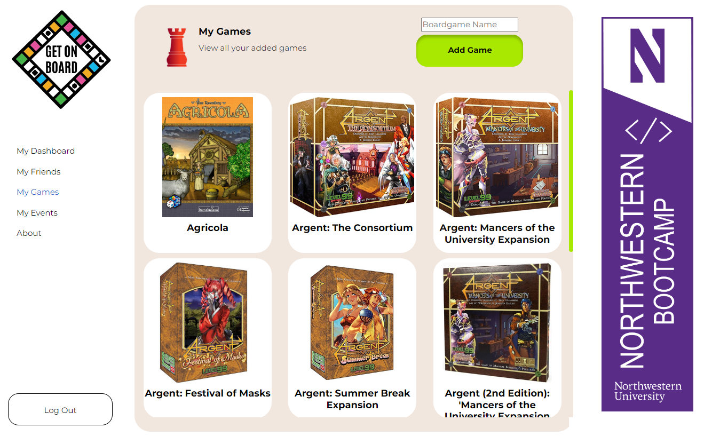
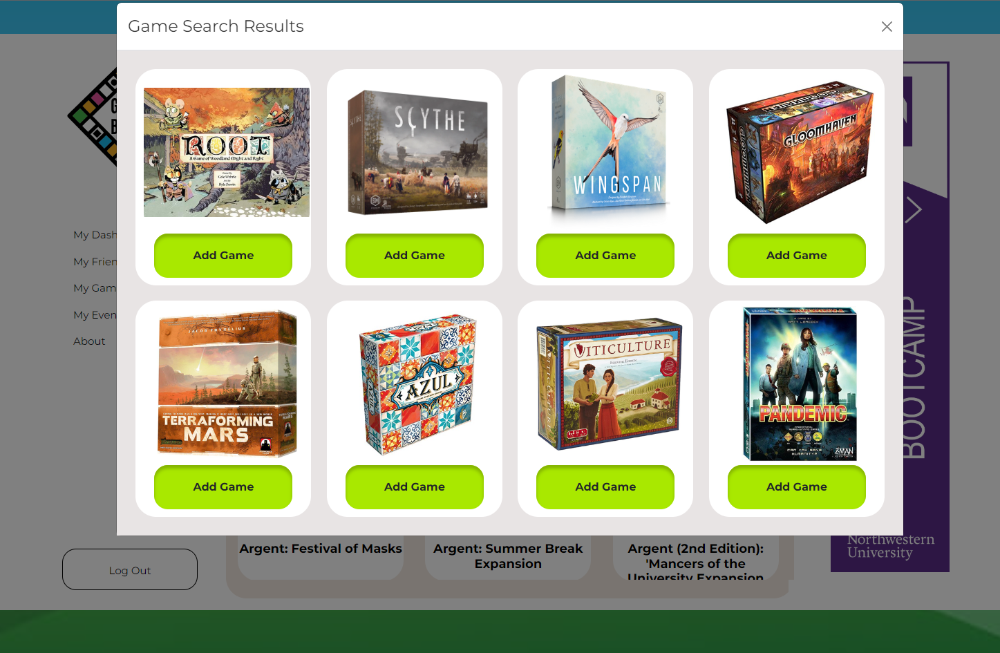
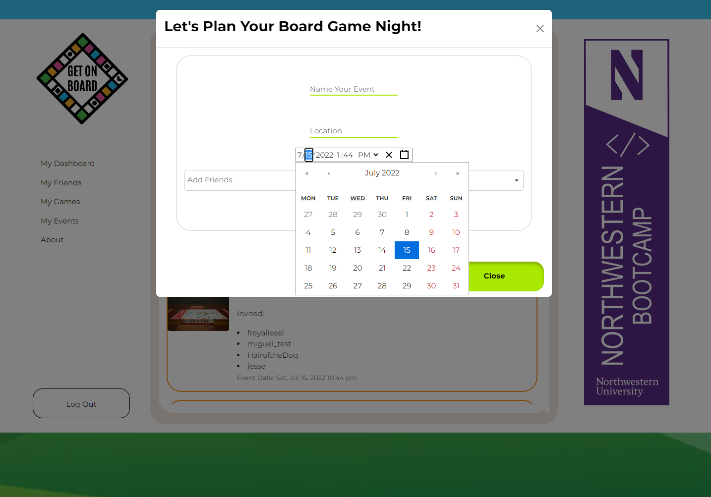

# Get On Board


## Description

Get on Board is a web application made by the Stale Mates to help board gamers plan and manage board game nights with their friends. The site is built using the MERN stack, and allows players to keep track of their existing board game library, create events with their friends, and decide on what games to play based on what games their friends currently own.

## User Story

AS A board game player  
I WANT TO track what games I own  
I WANT TO see what games my friends have  
I WANT to schedule boardgame meetups with friends.

## Table of Contents

- [Technology](#technology)
- [Usage](#usage)
- [Contact](#contact)
- [License](#license)

## Technology

This site was built using the MERN stack.

### Frontend Tech

For the frontend, we used the following tech:

```
- React JS & React-Router
- Apollo Client
- Bootstrap & React-Bootstrap
- JWT-Decode
- React-Datetime-Picker & DayJS
- Font Awesome
- BoardGameAtlas API
```

### Backend Tech

On the backend, we used the following tech:

```
- Node.js & Express
- Apollo & GraphQL
- MongoDB & Mongoose
- JWT
- Bcrypt
```

## Usage

Visit the site at: [Get On Board Site](https://p3-getonboard.herokuapp.com/)

The following showcase the different views of the site when a user has created their account:

**User Dashboard**\


**My Friends**\


**My Games**\




**Events**\


## Contact

The members of Stale Mates -

Jesse Comeau - [github.com/JesseComeau](https://github.com/JesseComeau)  
Miguel Escobar - [github.com/mae2136](https://github.com/mae2136)  
K Glidden - [github.com/freyaliesel](https://github.com/freyaliesel)  
Lea Linnea - [github.com/lealinnea](https://github.com/lealinnea)

## License

Copyright (C) StaleMates 2022

 This program comes with ABSOLUTELY NO WARRANTY; for details type `show w'.
    This is free software, and you are welcome to redistribute it
    under certain conditions; type `show c' for details.

The hypothetical commands `show w' and `show c' should show the appropriate
parts of the General Public License.  Of course, your program's commands
might be different; for a GUI interface, you would use an "about box".

  You should also get your employer (if you work as a programmer) or school,
if any, to sign a "copyright disclaimer" for the program, if necessary.
For more information on this, and how to apply and follow the GNU GPL, see
<https://www.gnu.org/licenses/>.

  The GNU General Public License does not permit incorporating your program
into proprietary programs.  If your program is a subroutine library, you
may consider it more useful to permit linking proprietary applications with
the library.  If this is what you want to do, use the GNU Lesser General
Public License instead of this License.  But first, please read
<https://www.gnu.org/licenses/why-not-lgpl.html>.